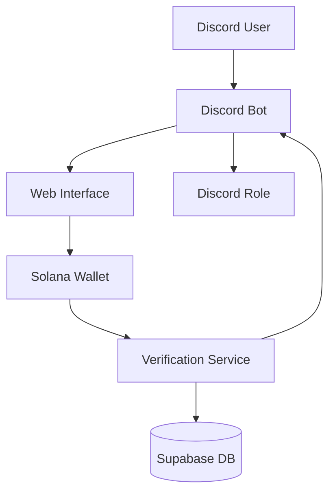
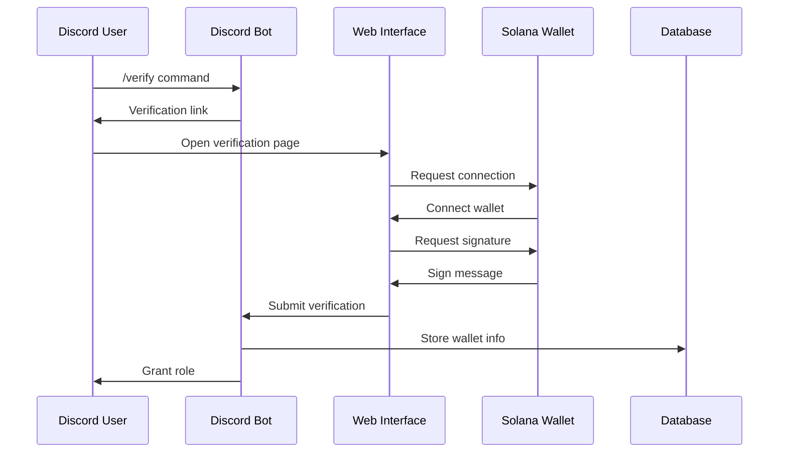

# Discord Work Token Verification Bot 🤖

<div align="center">

[](https://www.typescriptlang.org/)
[](https://discord.js.org/)
[](https://nextjs.org/)
[](https://solana.com/)

A Discord bot that verifies users based on their Solana wallet token holdings, providing token-gated access to exclusive Discord roles.

[Installation](#installation) • [Usage](#usage) • [Contributing](#contributing) • [Support](#support)

</div>

## 📑 Table of Contents

- [Overview](#overview)
- [System Architecture](#system-architecture)
- [Prerequisites](#prerequisites)
- [Project Structure](#project-structure)
- [Installation](#installation)
- [Configuration](#configuration)
- [Usage](#usage)
- [API Documentation](#api-documentation)
- [Contributing](#contributing)
- [Troubleshooting](#troubleshooting)
- [Security](#security)
- [License](#license)
- [Support](#support)

## 🌟 Overview

This bot enables server administrators to implement token-gated access by verifying users' Solana wallet token holdings. When users request verification, they're directed to a secure web interface where they can connect their wallet and complete the verification process.

### Key Features

- 🔐 Token-gated Discord role management
- 🔄 Real-time balance monitoring
- 👛 Multi-wallet support per user
- 🌐 Web-based verification flow
- ✍️ Cryptographic signature verification
- 📊 Token balance tracking

## 🏗 System Architecture



### Verification Flow



## 🔧 Prerequisites

- Node.js v18 or higher
- pnpm package manager
- Discord Bot Token ([Get Here](https://discord.com/developers/applications))
- Solana RPC endpoint ([Available Options](https://docs.solana.com/cluster/rpc-endpoints))
- Supabase account and credentials ([Sign Up](https://supabase.com/))

## 📁 Project Structure

```
verify-bot/
├── work-discord-bot/          # Discord bot backend
│   ├── src/
│   │   ├── index.ts          # Main bot logic
│   │   ├── commands/         # Bot commands
│   │   └── utils/           # Helper functions
│   └── package.json
│
└── work-verify/              # Next.js frontend
    ├── app/                 # Next.js app directory
    ├── components/         # React components
    ├── public/            # Static assets
    └── package.json
```

## ⚙️ Installation

1. Clone the repository:
```bash
git clone https://github.com/yourusername/verify-bot.git
cd verify-bot
```

2. Install dependencies:
```bash
# Install Discord bot dependencies
cd work-discord-bot
pnpm install

# Install frontend dependencies
cd ../work-verify
pnpm install
```

## 🔑 Configuration

### Discord Bot Configuration (`work-discord-bot/.env`)

```env
DISCORD_TOKEN=your_discord_bot_token
CLIENT_URL=http://localhost:3000
PORT=3001
SOLANA_RPC_URL=your_solana_rpc_url
GUILD_ID=your_discord_server_id
ROLE_ID=role_id_to_assign
SUPABASE_URL=your_supabase_url
SUPABASE_KEY=your_supabase_key
```

### Frontend Configuration (`work-verify/.env`)

```env
NEXT_PUBLIC_API_URL=http://localhost:3001
NEXT_PUBLIC_SOLANA_RPC_URL=your_solana_rpc_url
```

## 🚀 Usage

1. Start the Discord bot:
```bash
cd work-discord-bot
pnpm dev
```

2. Start the frontend:
```bash
cd work-verify
pnpm dev
```

### Bot Commands

| Command | Description |
|---------|-------------|
| `/verify` | Start the verification process |
| `/status` | Check verification status |
| `/help` | Display help information |

## 🔒 Security Considerations

- All wallet signatures are verified cryptographically
- Environment variables must be kept secure
- Rate limiting is implemented on all endpoints
- Regular token balance checks prevent exploitation

## 🤝 Contributing

We welcome contributions! See our [Contributing Guide](CONTRIBUTING.md) for details.

1. Fork the repository
2. Create a feature branch
3. Commit your changes
4. Push to your fork
5. Submit a Pull Request

## ❗ Troubleshooting

Common issues and solutions:

1. **Wallet Connection Issues**
   - Ensure your wallet has SOL for transactions
   - Check if your RPC endpoint is responsive

2. **Discord Bot Offline**
   - Verify your Discord token
   - Check bot permissions

3. **Role Assignment Failing**
   - Confirm bot role hierarchy
   - Verify bot permissions

## 💬 Support

Need help? Here's how to get support:

- 📋 [GitHub Issues](https://github.com/yourusername/verify-bot/issues)
- 💬 [Discord Community](your-discord-invite-link)
- 📧 [Email Support](mailto:your-email@example.com)

## 🔗 Resources

- [Discord.js Guide](https://discordjs.guide/)
- [Next.js Documentation](https://nextjs.org/docs)
- [Solana Cookbook](https://solanacookbook.com/)
- [Supabase Documentation](https://supabase.com/docs)

