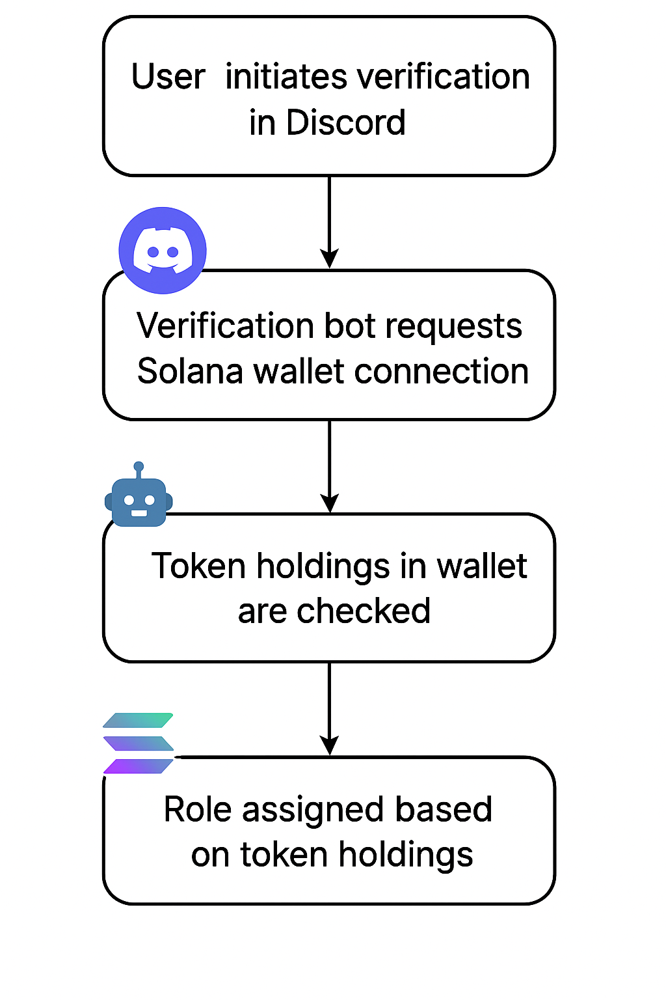

# 🔒 Verify Bot: Solana Wallet-Based Discord Authentication System

  
  


An enterprise-grade authentication solution that verifies Discord users based on token ownership in their Solana wallets. This project comprises two key components:

- **Web Verification Portal** (`work-verify`): A secure wallet connection interface built with Next.js  
- **Discord Bot** (`work-discord-bot`): A TypeScript bot managing user roles based on wallet token verification

🌐 **Live Demo**: [https://verify-bot-zeta.vercel.app/](https://verify-bot-zeta.vercel.app/)  
🔐 *Verification requires a code generated through the `/verify` command in Discord*

---

## 🚀 Core Features

- 🔐 **Non-Custodial Wallet Authentication**  
  Users sign messages using their Solana wallet  
  Secure validation of wallet ownership  

- 🧠 **Token Gating Logic**  
  Verifies token balances on the Solana blockchain  
  Configurable minimum token requirements  

- 🧩 **Discord Role Automation**  
  Automatically assigns and revokes roles  
  Scheduled revalidation every 24 hours  

- 🛡 **Modern Infrastructure**  
  Uses Express, Supabase, and JWT for secure backend  
  Modular structure for scalability and maintainability  

---

## ✅ Usage

1. Add the bot to your Discord server.  
2. In any channel, run the `/verify` command.  
3. The bot will reply with a "Connect Wallet" link.  
4. Click it to open the verification web app.  
5. Connect your Solana wallet and sign the message prompt.  
6. If your wallet meets the token requirements, the bot will automatically assign your Discord role.

---

## 🛠️ Tech Stack

- **Programming Languages**: TypeScript (97.1%), CSS (1.5%), JavaScript (1.4%)  
- **Web Framework**: Next.js (for the web application)  
- **Discord Library**: Discord.js (for the Discord bot)  
- **Blockchain Integration**: Solana Web3.js (to interact with the Solana blockchain)  
- **Database**: Supabase (for data persistence)  
- **Package Manager**: pnpm  
- **Server Framework**: Express.js (for handling verification requests)  

---

## 🧠 System Architecture



---

## ⚙️ Installation & Configuration

### Prerequisites

- Node.js v18+  
- pnpm 8.x  
- Supabase project  
- Discord Developer account  

---

### Setup: Web Portal

```bash
cd work-verify
pnpm install
cp .env.example .env
```

**Edit `.env`:**
```env
NEXT_PUBLIC_VERIFY_API_ENDPOINT="https://your-api-domain.com/api/verify-wallet"
SOLANA_RPC_URL="https://api.mainnet-beta.solana.com"
```

---

### Setup: Discord Bot

```bash
cd ../work-discord-bot
pnpm install
cp .env.example .env
```

**Edit `.env`:**
```env
DISCORD_TOKEN="your-bot-token"
SUPABASE_URL="https://your-supabase-project.supabase.co"
SUPABASE_KEY="your-supabase-key"
SOLANA_RPC_URL="https://api.mainnet-beta.solana.com"
CLIENT_URL="https://your-frontend-domain.com"
```

---

## 🗄️ Database (Supabase)

1. Create a new Supabase project  
2. Add this SQL schema in the SQL Editor:

```sql
CREATE TABLE holders (
  id SERIAL PRIMARY KEY,
  username VARCHAR(255) NOT NULL,
  discord_user_id VARCHAR(255) UNIQUE NOT NULL,
  addresses TEXT[] NOT NULL,
  is_active BOOLEAN DEFAULT FALSE,
  created_at TIMESTAMPTZ DEFAULT NOW(),
  updated_at TIMESTAMPTZ DEFAULT NOW()
);
```

3. Enable Row Level Security and configure proper access policies

---

## 🧩 File Structure

### Web App

```
work-verify/
├── app/
│   ├── api/          # API Routes
│   └── verify/       # Verification Logic
├── lib/
│   └── solana.ts     # Wallet utilities
└── styles/           # TailwindCSS setup
```

### Bot

```
work-discord-bot/
├── src/
│   ├── lib/
│   │   ├── discord.ts   # Discord logic
│   │   └── database.ts  # Supabase interactions
│   └── index.ts         # Bot entry point
└── types/               # Type definitions
```

---

## ⚙️ Token Requirements

Update the `TOKEN_CONFIG` in both services:

```ts
const TOKEN_CONFIG = {
  MINT_ADDRESS: "F7Hwf8ib5DVCoiuyGr618Y3gon429Rnd1r5F9R5upump",
  REQUIRED_BALANCE: 200000, // 0.2 tokens
  DECIMALS: 6
};
```

---

## 👷 Running the App

### Development

```bash
# Web
cd work-verify && pnpm dev

# Bot
cd ../work-discord-bot && pnpm dev
```

### Production

```bash
pnpm build

# Start services
cd work-verify && pnpm start
cd work-discord-bot && node dist/index.js
```

---

## 📈 Monitoring & Logs

```bash
# Health Check
curl https://your-api-domain.com/health

# Bot Logs (Systemd example)
journalctl -u verify-bot -f
```

---

## 🤝 Contribution Guide

1. Fork this repository  
2. Create a new feature branch  
3. Follow commit conventions (`feat:`, `fix:`, `docs:` etc)  
4. Push changes and open a pull request  

---

## 📜 License

[MIT License](LICENSE)

---

## 🙏 Acknowledgements

- [Solana Labs](https://solana.com/)  
- [Discord Developer Docs](https://discord.com/developers/docs)  
- [Supabase](https://supabase.com/)  
- [Vercel](https://vercel.com/)
